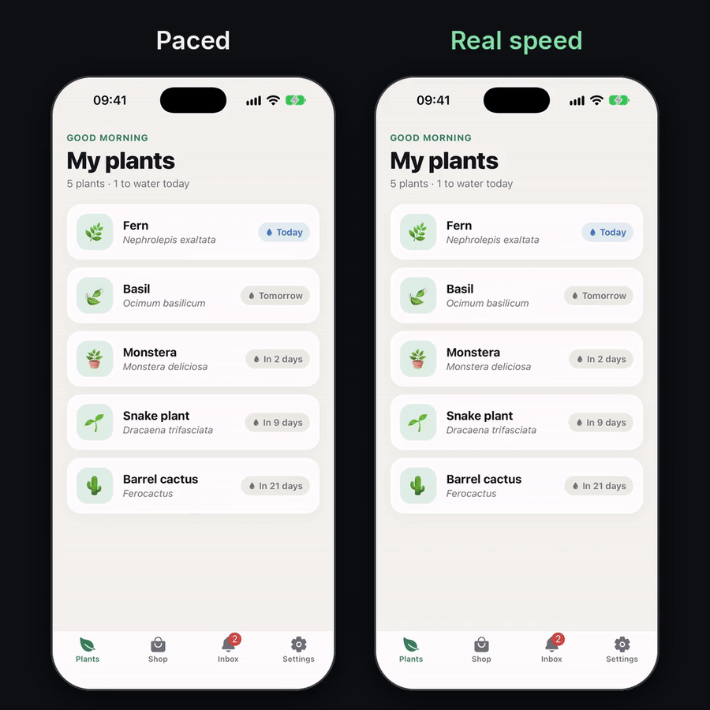

# @avasapp/agent-bridge

Let coding agents drive a running React Native app directly. Seed data, flip flags, navigate and check the screen in **milliseconds**, without tapping through the app.

## Demo



<!-- TODO: upload example/media/demo-x.mp4 in GitHub's web editor and put the URL it gives here. GitHub only plays an mp4 uploaded that way. -->

[`example/flows/demo.mjs`](example/flows/demo.mjs) driving [the example app](example) in Expo Go, all on one Mac:

| Call | Round trip |
| --- | --- |
| `bridge.ping` | 1–4 ms |
| `screen.findText` | 3–9 ms |
| `query.pin`, `store.call`, `router.navigate` | 11–44 ms, render included |
| 10 steps, no pauses | 150–200 ms, 0.2 s wall |

```
10 steps, all local on one Mac:   150 ms of calls, 0.2 s wall with no pauses
same flow from another machine:   ~57 ms per call (network)
same screen check via a11y tree:  450–970 ms
```

Works on Expo (dev-tools socket) and on bare React Native (CDP over Metro). Dev builds only: release builds get empty stubs.

## Install

```sh
bun add -d @avasapp/agent-bridge   # or npm / yarn / pnpm
```

## In the app

Mount the hook in a file that only runs in development. You choose every tool; adapters for common libraries are one import away.

```tsx
import { cdpTransport, useAgentBridge } from '@avasapp/agent-bridge'
import { expoTransport } from '@avasapp/agent-bridge/expo'
import { queryTools } from '@avasapp/agent-bridge/tanstack-query'
import { storeTools } from '@avasapp/agent-bridge/zustand'
import { mmkvTools } from '@avasapp/agent-bridge/react-native-mmkv'
import { routerTools } from '@avasapp/agent-bridge/expo-router'
import { router } from 'expo-router'

export function AgentBridge() {
  const queryClient = useQueryClient()
  useAgentBridge({
    name: 'rider',
    transports: [expoTransport(), cdpTransport()],
    tools: {
      ...queryTools(queryClient),
      ...storeTools({ settings: useSettingsStore, auth: useAuthStore }),
      ...mmkvTools({ storage }),
      ...routerTools(router),
      // Your own tools: any function, JSON in and out.
      'auth.signIn': (session) => signInWith(session),
    },
  })
  return null
}
```

Every app also gets `bridge.ping`, `bridge.tools` and `screen.findText`.

## From the agent

```sh
npx agent-bridge devices
npx agent-bridge tools
npx agent-bridge call query.pin '[["features"], {"wallet": false}]'
npx agent-bridge call router.navigate /inbox
npx agent-bridge call screen.findText '"Seeded by the agent"'
npx agent-bridge run flows/wallet-off.mjs
```

```ts
import { connect } from '@avasapp/agent-bridge/client'

const app = await connect({ metro: 'localhost:8081' })
await app.call('query.pin', ['features'], { wallet: false })
await app.call('router.navigate', '/inbox')
const { onScreen } = await app.call<{ onScreen: number }>('screen.findText', 'Seeded by the agent')
```

A flow is a module the CLI runs without a model in the loop:

```js
export default async ({ step }) => {
  await step('flag: wallet off', 'query.pin', ['features'], { wallet: false })
  await step('open Inbox', 'router.navigate', '/inbox')
  await step('check message', 'screen.findText', 'Seeded by the agent')
}
```

## Adapters

| Import | Tools | Needs |
| --- | --- | --- |
| `@avasapp/agent-bridge/tanstack-query` | `query.list` `get` `set` `pin` `unpin` `unpinAll` `refetch` `invalidate` | your `QueryClient` |
| `@avasapp/agent-bridge/zustand` | `store.list` `get` `set` `call` | your stores |
| `@avasapp/agent-bridge/react-native-mmkv` | `mmkv.list` `keys` `get` `set` `delete` | your MMKV instances |
| `@avasapp/agent-bridge/expo-router` | `router.navigate` `push` `replace` `back` | `router` from expo-router |

A pin keeps seeded data in place through refetches until you unpin it.

## Transports

| | Expo dev-tools socket | CDP |
| --- | --- | --- |
| Round trip, local | 0.5 ms | 1.3 ms |
| Emoji in payloads | yes | yes (escaped for you) |
| Works with | Expo CLI | any RN app on Metro |

`connect()` tries Expo first and falls back to CDP.

## Release builds

Every entry point is gated on `process.env.NODE_ENV`, like `react/index.js`: Metro inlines it and a release bundle gets empty stubs. Check a bundle in CI:

```sh
npx agent-bridge assert-absent path/to/main.jsbundle
```

## Traps we hit

- **Run the agent on the machine with the simulator.** Every call pays the network otherwise.
- **Hidden tabs stay mounted.** `screen.findText` skips anything under an inactive `RNSScreen`.
- **Expo checks the debugger's Origin** against the host Metro advertises and drops mismatches silently. The client reads it from the manifest.
- **Expo's socket broadcasts to every app.** Calls are addressed to one device; pick it with `--device` when several are connected.
- **Screen checks through the accessibility tree are slow** (hundreds of ms each). Check in-app, and keep one real UI check per flow.

## License

MIT © Avas Enterprises
