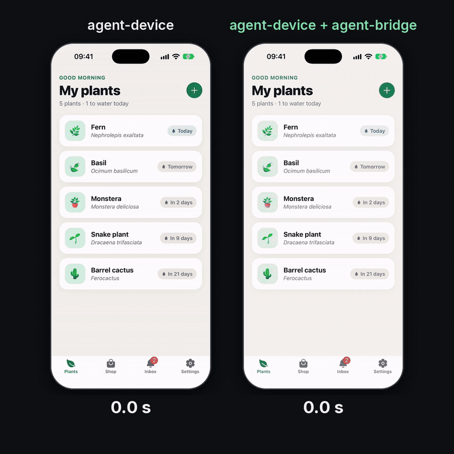

# @avasapp/agent-bridge

Let coding agents drive a running React Native app directly. Seed data, flip flags, fake realtime messages, navigate and check the screen in **milliseconds**, without tapping through the app. It works alongside [agent-device](https://github.com/callstack/agent-device): agent-device opens the app and handles native UI, and agent-bridge handles everything inside the app.

## Demo



The same checks on [the example app](example) in Expo Go, both at real speed, all on one Mac:

- **agent-device alone** ([`demo-agent-device.mjs`](example/flows/demo-agent-device.mjs)) taps and types through the UI, edits the fake backend and reloads to change the flag and the data, and asks the realtime server to push a message.
- **agent-device + agent-bridge** ([`demo.mjs`](example/flows/demo.mjs)) makes each change with one call, then undoes them all with `bridge.restore`.

agent-device 0.21.15 won't press or fill most of this screen by selector on the iOS 27 simulator ([callstack/agent-device#2996](https://github.com/callstack/agent-device/issues/2996)), so the agent-device side looks up each element's frame and taps its centre. That adds one lookup per tap or fill.

| Call | Round trip |
| --- | --- |
| `bridge.ping` | 1–4 ms |
| `screen.findText`, `screen.waitFor` (already there) | 3–9 ms |
| `screen.fill`, `screen.press` | 20–120 ms, render included |
| `query.pin`, `store.call`, `router.navigate` | 11–55 ms, render included |
| 19 steps, no pauses | 1.3–1.5 s wall, 0.9 s of it waiting on the fake backend |

```
19 steps with agent-bridge:       1.4 s wall
same checks, agent-device alone:  22.4 s wall
same flow from another machine:   ~57 ms per call (network)
same screen check via a11y tree:  450–970 ms
```

Works on Expo (dev-tools socket) and on bare React Native (CDP over Metro). Dev builds only: release builds get empty stubs.

## Install

```sh
bun add -d @avasapp/agent-bridge   # or npm / yarn / pnpm
```

### Teach your agent

The package ships an agent skill that tells your agent when and how to drive the app. Add it to Claude Code, Cursor, Codex and other agents:

```sh
npx skills add avas-app/agent-bridge
```

In Claude Code you can install it as a plugin instead:

```
/plugin marketplace add avas-app/agent-bridge
/plugin install agent-bridge@agent-bridge
```

## In the app

Mount the hook in a file that only runs in development. You choose every tool; adapters for common libraries are one import away.

```tsx
import { cdpTransport, useAgentBridge } from '@avasapp/agent-bridge'
import { expoTransport } from '@avasapp/agent-bridge/expo'
import { queryTools } from '@avasapp/agent-bridge/tanstack-query'
import { storeTools } from '@avasapp/agent-bridge/zustand'
import { mmkvTools } from '@avasapp/agent-bridge/react-native-mmkv'
import { routerTools } from '@avasapp/agent-bridge/expo-router'
import { networkTools } from '@avasapp/agent-bridge/network'
import { router, useNavigationContainerRef } from 'expo-router'

export function AgentBridge() {
  const queryClient = useQueryClient()
  useAgentBridge({
    name: 'my-app',
    transports: [expoTransport(), cdpTransport()],
    tools: {
      ...queryTools(queryClient),
      ...storeTools({ settings: useSettingsStore, auth: useAuthStore }),
      ...mmkvTools({ storage }),
      ...routerTools(router, { navigation: useNavigationContainerRef() }),
      ...networkTools(),
      // Your own tools: any function, JSON in and out.
      'auth.signIn': (session) => signInWith(session),
    },
  })
  return null
}
```

Every app also gets:

- `screen.snapshot`: buttons, inputs, text and `testID` views on screen, with positions.
- `screen.fill`, `screen.press`: call an input's or button's own handlers, found by `testID`, label, placeholder or text, and return once React has rendered the result.
- `screen.waitFor`, `screen.findText`: wait for, or check, text or a target on screen.
- `bridge.restore`: undo what the agent changed, by running every `*.restore` tool.
- `bridge.logs`, `bridge.ping`, `bridge.tools`.

Custom tools that change the screen can `await settle()` (from `@avasapp/agent-bridge`) so the next check sees the render.

Errors come back on their own: each reply carries what the app logged with `console.error`, threw or left unhandled since the previous reply, tagged with the call it happened during or after.

## From the agent

```sh
npx agent-bridge session start            # hold one connection; call/tools/run reuse it
npx agent-bridge tools
npx agent-bridge scenarios                # setups the app defines, e.g. signedIn
npx agent-bridge call scenario.apply '["signedIn", {"user": {"name": "Ada"}}]'
npx agent-bridge call query.pin '[["features"], {"beta": false}]'
npx agent-bridge call screen.press '"add-plant"'
npx agent-bridge call screen.fill '["plant-name", "Fiddle leaf fig"]'
npx agent-bridge call screen.waitFor '"Name is required"'
npx agent-bridge run flows/add-plant.mjs --strict   # fail if the app logged an error
npx agent-bridge session stop             # runs bridge.restore, then disconnects
```

A session stops itself, restore included, after 15 minutes without calls (`--idle`), and reconnects if the app reloads.

```ts
import { connect } from '@avasapp/agent-bridge/client'

const app = await connect({ metro: 'localhost:8081' })
await app.call('router.navigate', '/add')
await app.call('screen.fill', 'plant-name', 'Fiddle leaf fig')
await app.call('screen.press', 'save-plant')
```

A flow is a module the CLI runs without a model in the loop:

```js
export const scenario = 'signedIn'   // optional: see Scenarios

export default async ({ step }) => {
  await step('flag: beta off', 'query.pin', ['features'], { beta: false })
  await step('save empty form', 'screen.press', 'save-plant')
  await step('error shown', 'screen.waitFor', 'Name is required')
  await step('undo', 'bridge.restore')
}
```

No device tool is needed. Pair one (such as agent-device) with the bridge for what it can't reach: system alerts, permission prompts, the keyboard, screenshots, and one real tap per flow.

## Scenarios

Most flows need the app in a known state first, above all a signed-in user. A scenario is a named setup the app defines once, for example a user who is signed in **locally**: a fake token, a fake user, and every request answered in the app, never by the real server.

```ts
import { type Scenarios, useAgentBridge } from '@avasapp/agent-bridge'
import { mockApi, strictNetwork } from '@avasapp/agent-bridge/network'

const scenarios: Scenarios = {
  signedIn: {
    description: 'Signed in locally; no request reaches a server.',
    options: '{ user?: { name?, email? } }',
    apply: async ({ options, call, onUndo }) => {
      const user = { ...defaultUser, ...options?.user }
      // Guards first, so nothing leaves the app with the fake token.
      onUndo(realtimeGate.close())
      onUndo(strictNetwork({ allow: ['cdn.example.com'] }))
      onUndo(mockApi(API_URL, {
        'GET /me': { json: user },
        'GET /orders/:id': ({ params }) => ({ json: orders[params.id] }),
      }))
      onUndo(await addNativeRewriteRule(tilesHost, localTiles))  // any app code
      await call('store.set', 'auth', { token: 'local', user })  // store.restore undoes it
      return { user }
    },
  },
}

useAgentBridge({ tools, scenarios })
```

- `apply` is ordinary app code. `call(tool, ...args)` runs a bridge tool, and that tool's own restorer undoes the change. `onUndo(fn)` covers everything else: app mocks, gates, native state such as a URL-rewrite rule.
- `bridge.restore` runs every scenario's undo callbacks **last**, newest first, after the store, query and network restorers. The guards stay up until the app is back in its real state. If `apply` throws, the callbacks it had registered run straight away.
- Tools: `scenario.list`, `scenario.apply [name, options?]` (applying an active one again undoes it first) and `scenario.restore`. `npx agent-bridge scenarios` lists them.
- A flow declares what it needs with `export const scenario = 'signedIn'`, or `export const scenarios = ['signedIn', { name: 'cart', options: { items: 2 } }]`. `agent-bridge run` applies them before the flow and runs `bridge.restore` afterwards, even when the flow fails. The flow gets what each `apply` returned as `scenarios.signedIn`. A failed restorer makes the run exit non-zero. `run --scenario signedIn` adds one to any flow, with JSON options after `=` (`--scenario 'signedIn={"user":{"name":"Ada"}}'`); it replaces a declared one of the same name.

**Strict network.** `strictNetwork({ allow?, status?, offline? })` from `@avasapp/agent-bridge/network` (or `net.strict` from the agent) fails every `fetch` or `XMLHttpRequest` that no mock answers. The request gets a 501 with `{ error: "agent-bridge strict network: no mock for GET https://…" }` and a `console.error`, so the agent sees it with the reply. With `offline: true` it fails like a network failure instead. `net.strict` lists the requests it blocked. `allow` lets hosts through (substrings or RegExps); Metro always gets through. It covers JS requests only: images, native SDKs (a map's tile fetches, say), and WebSockets go around it, so a scenario handles those with app code and `onUndo`.

**Fixtures.** `mockApi(baseUrl, routes, options?)` answers `'METHOD /path'` routes, or `'/path'` for any method. `:name` matches one path segment and `*` the rest; the query string is ignored. A route's value is a response (`{ json }`, `{ status, body }`…) or a handler that gets the request with `params` and `query`. It returns a function that removes the routes.

**Gates.** Some side effects must wait while a scenario runs, such as a realtime client connecting with the fake token and signing the user out when auth fails. `createGate(name)` from `@avasapp/agent-bridge` is a counted switch: `gate.close()` returns the function that reopens it (hand that to `onUndo`), `gate.closed` is what app code checks, and `gate.subscribe(fn)` hears it change. In a release build it's always open. `realtime.connection` isn't enough on its own: it hides the state from the app, but the client still connects.

The example app's [`src/dev/scenarios.ts`](example/src/dev/scenarios.ts) is a complete local `signedIn`, and [`flows/checks/signed-in.mjs`](example/flows/checks/signed-in.mjs) declares it.

## Adapters

| Import | Tools | Needs |
| --- | --- | --- |
| `@avasapp/agent-bridge/tanstack-query` | `query.list` `get` `set` `pin` `unpin` `unpinAll` `refetch` `invalidate` `restore` | your `QueryClient` |
| `@avasapp/agent-bridge/zustand` | `store.list` `get` `set` `call` `restore` | your stores |
| `@avasapp/agent-bridge/react-native-mmkv` | `mmkv.list` `keys` `get` `set` `delete` `restore` | your MMKV instances |
| `@avasapp/agent-bridge/expo-router` | `router.navigate` `push` `replace` `back` `current` | `router` and `useNavigationContainerRef()` from expo-router |
| `@avasapp/agent-bridge/network` | `net.log` `mock` `mocks` `unmock` `strict` `clear` `restore` | nothing: patches `fetch` and `XMLHttpRequest` in dev |
| `@avasapp/agent-bridge/ably` | `realtime.channels` `log` `emit` `mute` `unmute` `connection` `restore` | your Ably `Realtime` client |
| `@avasapp/agent-bridge/socket.io` | `realtime.channels` `log` `emit` `mute` `unmute` `connection` `restore` | your socket.io `Socket` |
| `@avasapp/agent-bridge/realtime` | `realtime.channels` `log` `emit` `mute` `unmute` `restore` | two lines in your own subscribe function |

A pin keeps seeded data in place through refetches until you unpin it. `net.mock('/inbox', { status: 500 })` or `{ offline: true }` fails a route; apps can fake a whole backend with `mockRequests` or `mockApi` from the same import, and turn on strict mode with `strictNetwork`.

## Realtime

The realtime tools let an agent see realtime messages, send the app a fake one, and stop real ones from overwriting a state it set up. They work with any library.

With Ably or socket.io, pass the client where you create it, **before the app subscribes**. Listeners added earlier stay invisible.

```ts
import { ablyTools } from '@avasapp/agent-bridge/ably'
import { socketIoTools } from '@avasapp/agent-bridge/socket.io'

export const ably = new Ably.Realtime(options)
export const realtimeDevTools = ablyTools(ably)     // or socketIoTools(socket)

// in AgentBridge: tools: { ...realtimeDevTools, ... }
```

With any other library, or your own subscribe layer, wrap each listener:

```ts
import { createRealtimeTap } from '@avasapp/agent-bridge/realtime'

export const realtimeTap = createRealtimeTap()   // tools: { ...realtimeTap.tools }

export function subscribe(channel: string, onMessage: (message: Message) => void) {
  const { listener, unsubscribe } = realtimeTap.wrap(channel, onMessage)
  const off = client.subscribe(channel, listener)
  return () => { off(); unsubscribe() }
}
```

```sh
npx agent-bridge call realtime.channels
npx agent-bridge call realtime.mute '"order-42"'                       # the real feed goes quiet
npx agent-bridge call realtime.emit '["order-42", {"name": "status", "data": {"status": "arrived"}}]'
npx agent-bridge call realtime.log '{"channel": "order-42"}'
npx agent-bridge call realtime.connection '"disconnected"'             # null goes back
```

- `realtime.emit` runs the app's own handlers. Ably gets an Ably message (`{ id, name, data, timestamp }` plus what you pass), socket.io gets the arguments after the event name (`["chat", "a", "b"]` calls `listener("a", "b")`), and `createRealtimeTap` gets the value as is, or what its `toMessage` option builds.
- `realtime.mute` drops real messages; injected ones still get through unless you pass `{ "dropInjected": true }`. `"*"` mutes every channel.
- `realtime.connection` fakes a state through the client's own events (Ably's `connection.on` and `connection.state`, socket.io's `connect` / `disconnect`) and drops real messages until the state is `connected` again. Ably channel states don't follow. `socket.connected` keeps its real value: socket.io reads it itself, and faking it would hold real traffic back until the next reconnect.
- `realtime.log` keeps the last 50 messages, and logs a message once however many listeners get it.
- `createRealtimeTap` takes `describe` (what to log), `toMessage` (what `emit` delivers), `channelInfo` (extras for `realtime.channels`), `connection` (to add `realtime.connection`) and `namespace` (for a second tap).
- socket.io `onAny` listeners don't get injected events.

### Writing an adapter

To patch a client instead of wrapping each listener, name its add and remove methods and say which channel a call is for. `tapListeners` handles the bookkeeping and every remove form (all, by event, by listener). `realtimeAdapter` patches each client once. A Pusher-style `channel.bind(event, fn)` is this much:

```ts
import { createRealtimeTap, realtimeAdapter, tapListeners } from '@avasapp/agent-bridge/realtime'

export const pusherTools = realtimeAdapter((channel: Channel, options: {}) => {
  const tap = createRealtimeTap()
  tapListeners(tap, channel, {
    add: 'bind',
    remove: 'unbind',
    channel: ([event]) => `${channel.name}:${event}`,   // undefined leaves a call alone
  })
  return tap
})
```

Pass `accepts` when a listener filters by event, and `message: 'args'` when the message is every argument (as in socket.io). `fakeableConnection(client, { property, events, states, announce })` adds `realtime.connection`: it fakes the state property and silences the client's own change events while a fake is on. Pass `fakeProperty: false` if the client reads that property itself to decide whether to deliver or send. [`src/adapters/`](src/adapters) has the Ably and socket.io adapters built this way.

## Transports

| | Expo dev-tools socket | CDP |
| --- | --- | --- |
| Round trip, local | 0.5 ms | 1.3 ms |
| Emoji in payloads | yes | yes (escaped for you) |
| Works with | Expo CLI | any RN app on Metro |

`connect()` tries Expo first and falls back to CDP.

## Release builds

Every entry point is gated on `process.env.NODE_ENV`, like `react/index.js`: Metro inlines it and a release bundle gets empty stubs. Check a bundle in CI:

```sh
npx agent-bridge assert-absent path/to/main.jsbundle
```

## Traps we hit

- **Run the agent on the machine with the simulator.** Every call pays the network otherwise.
- **Hidden tabs stay mounted.** `screen.findText` skips anything under an inactive `RNSScreen`.
- **Expo checks the debugger's Origin** against the host Metro advertises and drops mismatches silently. The client reads it from the manifest.
- **Expo Go on Android has no CDP `Runtime.evaluate`.** Use the Expo socket there (the default); CDP works in dev builds and in Expo Go on iOS.
- **Expo's socket broadcasts to every app.** Calls are addressed to one device; pick it with `--device` when several are connected.
- **Screen checks through the accessibility tree are slow** (hundreds of ms each). Check in-app, and keep one real UI check per flow.
- **`screen.fill` skips the keyboard.** It runs the input's handlers, so validation and state are real, but autocorrect, native `maxLength` and uncontrolled inputs' native text are not.
- **Keep your `QueryClient` in state** (`useState(() => new QueryClient())`). Created at module level, a Fast Refresh can leave the bridge holding a different client than the screen.

## License

MIT © Avas Enterprises
